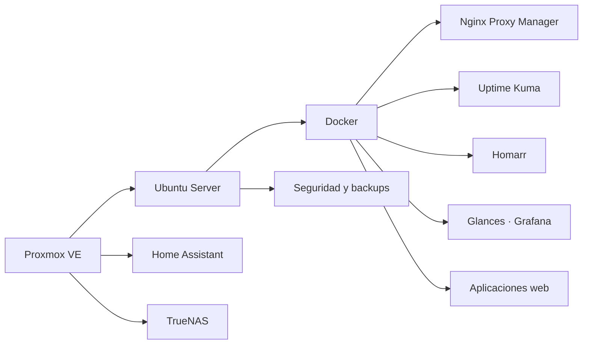

<div align="center">


### Transformo procesos reales en sistemas web, automatizaciones e infraestructura confiable

[](https://github.com/poto212)


<br>

[**Perfil**](#perfil-profesional) · [**Proyectos**](#proyectos-destacados) · [**Tecnologías**](#tecnologías) · [**Infraestructura**](#infraestructura) · [**Contacto**](#contacto)

</div>

---

<h2 id="perfil-profesional">👨‍💻 Perfil profesional</h2>

<table>
<tr>
<td width="60%" valign="top">

Soy **Licenciado en Sistemas** y trabajo como **Jefe de IT**, combinando dirección tecnológica, desarrollo de software, infraestructura, soporte y automatización.

Me especializo en convertir procesos manuales o dispersos en soluciones digitales simples, seguras y escalables.

- Sistemas web multiusuario y productos SaaS.
- CRM, automatización comercial e integraciones.
- Linux, Docker, Nginx y despliegues.
- Proxmox, monitoreo, seguridad y backups.
- Inteligencia artificial aplicada a procesos reales.

</td>
<td width="40%" valign="top">

### 🎯 Enfoque actual

```yaml
rol: Jefe de IT
perfil: Desarrollo + Infraestructura
objetivo: Crear productos SaaS propios
prioridades:
  - Sistemas empresariales
  - Automatización con IA
  - DevOps y despliegues
  - Ciberseguridad
  - Monitoreo
ubicacion: Argentina
```

</td>
</tr>
</table>

---

## ⚡ Actualmente

<table>
<tr>
<td width="33%" align="center" valign="top">

### 📊 Construyendo

Sistemas comerciales, CRM y herramientas internas.

</td>
<td width="33%" align="center" valign="top">

### 🤖 Automatizando

Procesos empresariales con IA e integraciones.

</td>
<td width="33%" align="center" valign="top">

### 🖥️ Administrando

Linux, Docker, Nginx, Proxmox y monitoreo.

</td>
</tr>
</table>

---

<h2 id="proyectos-destacados">🚀 Proyectos destacados</h2>

<table>
<tr>
<td width="50%" valign="top">

### 📊 Sistema de gestión comercial

MVP web con dashboard, ingresos, egresos, clientes, proveedores, stock, facturación demo, informes, roles, MySQL y Docker.


</td>
<td width="50%" valign="top">

### 💬 Plataforma WhatsApp + CRM

Campañas, múltiples sesiones, agenda, seguimiento comercial, métricas, automatización e integración con inteligencia artificial.


</td>
</tr>
<tr>
<td width="50%" valign="top">

### 🛒 Comparador de precios

Comparación de supermercados por unidad, litro, cantidad y lista de compra, con ofertas y análisis de conveniencia.


</td>
<td width="50%" valign="top">

### 🌾 Gestión de silos

Migración de una aplicación Java a una plataforma web multiusuario con roles, reportes, importación y copias de seguridad.


</td>
</tr>
</table>

> Los proyectos con lógica empresarial o información sensible se mantienen privados. El perfil presenta su alcance, arquitectura y estado real de avance.

---

<h2 id="tecnologías">🛠️ Tecnologías</h2>

<div align="center">

### Desarrollo


### Datos e infraestructura


<br><br>


</div>

---

<h2 id="infraestructura">🏗️ Infraestructura y laboratorio</h2>



<div align="center">

`Proxmox` → `Ubuntu Server` → `Docker` → `Nginx` → `Aplicaciones` → `Monitoreo`

</div>

---

## 💼 Capacidades

<table>
<tr>
<td width="50%">🌐 Desarrollo de sistemas web</td>
<td width="50%">🐳 Docker y despliegues</td>
</tr>
<tr>
<td>⚙️ Automatización empresarial</td>
<td>🖥️ Linux, redes y Proxmox</td>
</tr>
<tr>
<td>🤖 Integración de inteligencia artificial</td>
<td>📊 Monitoreo y observabilidad</td>
</tr>
<tr>
<td>🧑‍💼 CRM y herramientas internas</td>
<td>🔐 Infraestructura y seguridad</td>
</tr>
</table>

---

<div id="contacto" align="center">

## 🤝 Contacto y colaboración

Interesado en proyectos de desarrollo, infraestructura, automatización, inteligencia artificial y transformación digital.

[](https://github.com/poto212?tab=overview)
[](https://github.com/poto212?tab=repositories)

<br><br>


</div>
