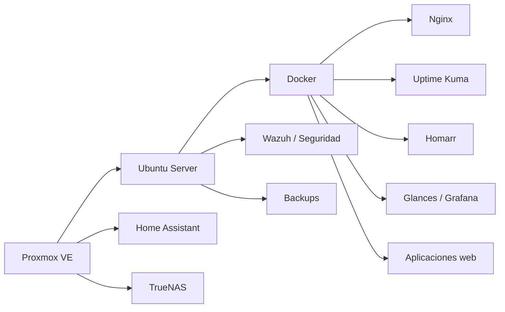

<div align="center">


### Transformo procesos reales en sistemas web, automatizaciones e infraestructura confiable

[](https://github.com/poto212)


<br>

[**Perfil**](#perfil-profesional) · [**Proyectos**](#proyectos-destacados) · [**Stack**](#stack-tecnológico) · [**Infraestructura**](#infraestructura-y-laboratorio) · [**Contacto**](#contacto)

</div>

---

<h2 id="perfil-profesional">👨‍💻 Perfil profesional</h2>

<table>
<tr>
<td width="60%" valign="top">

Soy **Licenciado en Sistemas** y trabajo como **Jefe de IT**, combinando gestión tecnológica, desarrollo de software, infraestructura, soporte, automatización y seguridad.

Mi enfoque está en transformar procesos manuales o dispersos en soluciones web simples, medibles, seguras y escalables.

- Desarrollo de sistemas web multiusuario y productos SaaS.
- CRM, gestión comercial, herramientas administrativas y automatización.
- Linux, Docker, Nginx, MySQL/PostgreSQL y despliegues productivos.
- Proxmox, monitoreo, observabilidad, backups y seguridad.
- Inteligencia artificial aplicada a operaciones y procesos empresariales.

</td>
<td width="40%" valign="top">

### 🎯 Enfoque 2026

```yaml
rol: Jefe de IT
perfil: Desarrollo + Infraestructura
objetivo: Construir productos SaaS propios
prioridades:
  - Sistemas empresariales
  - Automatización con IA
  - Ciberseguridad
  - DevOps y despliegues
  - Monitoreo multiservidor
  - Productos comercializables
ubicacion: Argentina
```

</td>
</tr>
</table>

---

## ⚡ Actualmente

<table>
<tr>
<td width="25%" align="center" valign="top">

### 🧩 Construyendo

Sistemas empresariales, CRM y plataformas SaaS.

</td>
<td width="25%" align="center" valign="top">

### 🤖 Automatizando

Procesos con IA, integraciones y mensajería.

</td>
<td width="25%" align="center" valign="top">

### 🖥️ Administrando

Linux, Docker, Proxmox, Nginx y bases de datos.

</td>
<td width="25%" align="center" valign="top">

### 🛡️ Protegiendo

Monitoreo, alertas, backups y hardening.

</td>
</tr>
</table>

---

<h2 id="proyectos-destacados">🚀 Proyectos destacados en desarrollo</h2>

<table>
<tr>
<td width="50%" valign="top">

### 📊 Sistema de gestión comercial

Plataforma web para clientes, ventas, cuenta corriente, stock, facturación, cobranzas, presupuestos, reportes, importación histórica desde Excel, roles, auditoría y panel de administración.


</td>
<td width="50%" valign="top">

### 💬 Plataforma de mensajería + CRM

Sistema para gestión de campañas, agenda, contactos, múltiples sesiones, respuestas, métricas, control de envíos, automatización, alertas e integración con inteligencia artificial.


</td>
</tr>
<tr>
<td width="50%" valign="top">

### 🛡️ Plataforma de monitoreo multiservidor

Dashboard central para supervisar servidores Linux, servicios web, Docker, SSH, Samba, recursos, disponibilidad, incidentes, seguridad y alertas desde desktop o móvil.

Incluye integración conceptual con herramientas como **Proxmox, Uptime Kuma, Grafana, Wazuh, Glances y notificaciones externas**.


</td>
<td width="50%" valign="top">

### 🧾 Plataforma contable y fiscal

Sistema web para estudios contables y gestión de clientes: IVA, monotributo, tasas, autónomos, cargas sociales, conciliación bancaria, cuenta corriente, presupuestos, parámetros fiscales y comparativas entre períodos.

Diseñado con revisión humana previa a cualquier presentación o proceso sensible.


</td>
</tr>
<tr>
<td width="50%" valign="top">

### 🤝 CRM empresarial propio

Arquitectura de CRM para ventas, agenda, seguimiento de oportunidades, clientes, usados, planes, webchat, WhatsApp, reportes, métricas e integraciones con plataformas existentes.

Objetivo: reemplazar herramientas fragmentadas por una solución propia, escalable y controlada internamente.


</td>
<td width="50%" valign="top">

### 🛒 Comparador inteligente de precios

Plataforma para comparar productos de supermercados por precio final, unidad, litro, peso o cantidad; analizar listas de compra, detectar ofertas y estimar dónde conviene comprar.

Pensado como producto web comercializable y ampliable mediante automatización de datos.


</td>
</tr>
<tr>
<td width="50%" valign="top">

### 🌾 Gestión agropecuaria / silos

Modernización de una solución desarrollada originalmente en Java hacia una plataforma web multiusuario con dashboard, roles, cálculos, reportes, exportación PDF, importación de datos, auditoría y backups.


</td>
<td width="50%" valign="top">

### 🏢 Sistemas internos y automatización

Desarrollo de herramientas internas para métricas operativas, seguimiento de procesos, importación/exportación Excel, reportes, dashboards, roles y consolidación de información de distintas áreas.


</td>
</tr>
</table>

> 🔒 Los proyectos con lógica empresarial, credenciales, datos de clientes o información sensible permanecen privados. Este perfil muestra únicamente alcance funcional, tecnologías y objetivos generales.

---

## 🧠 Qué estoy desarrollando en estos proyectos

- **Dashboards ejecutivos** con métricas, estados, alertas e indicadores comparativos.
- **Arquitecturas multiusuario** con roles, permisos, auditoría y trazabilidad.
- **APIs y backends** preparados para integraciones y automatización.
- **Importación y exportación** de Excel, CSV, PDF y datos históricos.
- **Automatizaciones con IA** manteniendo validaciones y revisión humana cuando corresponde.
- **Seguridad por diseño**: control de acceso, validación de entradas, backups, hardening y monitoreo.
- **Despliegues reproducibles** con Linux, Docker y reverse proxy.
- **Monitoreo operativo** con métricas, disponibilidad, alertas y recuperación ante fallos.

---

<h2 id="stack-tecnológico">🛠️ Stack tecnológico</h2>

<div align="center">

### Desarrollo


### Datos e infraestructura


<br><br>


</div>

---

<h2 id="infraestructura-y-laboratorio">🏗️ Infraestructura y laboratorio</h2>



<div align="center">

`Proxmox` → `Ubuntu Server` → `Docker` → `Nginx` → `Aplicaciones` → `Monitoreo` → `Alertas`

</div>

---

## 💼 Capacidades

<table>
<tr>
<td width="50%">🌐 Desarrollo de sistemas web</td>
<td width="50%">🐳 Docker, Linux y despliegues</td>
</tr>
<tr>
<td>⚙️ Automatización empresarial</td>
<td>🖥️ Redes, servidores y Proxmox</td>
</tr>
<tr>
<td>🤖 Integración de inteligencia artificial</td>
<td>📊 Monitoreo y observabilidad</td>
</tr>
<tr>
<td>🧑‍💼 CRM y herramientas internas</td>
<td>🔐 Seguridad, backups y hardening</td>
</tr>
<tr>
<td>🗄️ MySQL / PostgreSQL</td>
<td>📈 Dashboards y reportes</td>
</tr>
</table>

---

## 🗺️ Roadmap personal 2026

```text
Sistemas internos → Productos SaaS → Automatización con IA
        ↓                 ↓                  ↓
  datos y procesos   arquitectura web    asistentes y agentes
        ↓                 ↓                  ↓
   dashboards       despliegue seguro    monitoreo continuo
```

Objetivo: evolucionar soluciones creadas para problemas reales hacia productos robustos, documentados y reutilizables.

---

<div id="contacto" align="center">

## 🤝 Contacto y colaboración

Interesado en proyectos de **desarrollo**, **infraestructura**, **automatización**, **inteligencia artificial**, **ciberseguridad** y **transformación digital**.

[](https://github.com/poto212?tab=overview)
[](https://github.com/poto212?tab=repositories)

<br><br>


</div>
