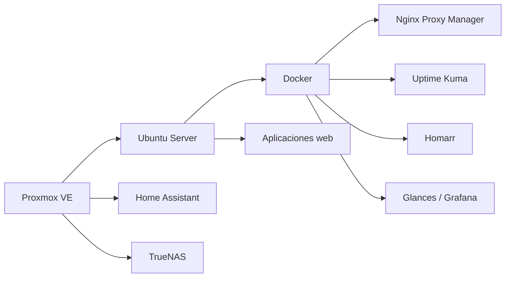

<div align="center">


<br>

[](https://github.com/poto212)
[](#)
[](#proyectos-destacados)

</div>

---

<table>
<tr>
<td width="58%" valign="top">

## 👨‍💻 Sobre mí

Soy **Licenciado en Sistemas** y trabajo como **Jefe de IT**, combinando gestión tecnológica, infraestructura, soporte y desarrollo.

Me especializo en convertir procesos manuales o dispersos en soluciones digitales simples, seguras y escalables.

- 🌐 Sistemas web multiusuario y SaaS.
- 🧑‍💼 CRM y automatización empresarial.
- 🐳 Docker, Linux, Nginx y despliegues.
- 🖥️ Virtualización con Proxmox.
- 📊 Monitoreo y observabilidad.
- 🤖 Inteligencia artificial aplicada a procesos reales.

</td>
<td width="42%" valign="top">

## 🎯 Enfoque actual

```yaml
rol: Jefe de IT
perfil: Full Stack + Infraestructura
objetivo: Productos SaaS propios
intereses:
  - Automatización
  - Inteligencia artificial
  - Ciberseguridad
  - DevOps
  - Sistemas empresariales
ubicacion: Argentina
```

</td>
</tr>
</table>

---

<h2 id="proyectos-destacados">🚀 Proyectos destacados</h2>

<table>
<tr>
<td width="50%" valign="top">

### 🧑‍💼 CRM empresarial

Gestión de prospectos, clientes, oportunidades, seguimiento comercial, reportes e integraciones.


</td>
<td width="50%" valign="top">

### 💬 Plataforma WhatsApp + CRM

Campañas, múltiples sesiones, agenda, métricas, automatización e integración con inteligencia artificial.


</td>
</tr>
<tr>
<td width="50%" valign="top">

### 🛒 Comparador de precios

Comparación por supermercado, unidad, litro, cantidad, listas de compra y mejores ofertas.


</td>
<td width="50%" valign="top">

### 🌾 Gestión de silos

Migración de una aplicación Java a una plataforma web multiusuario con roles, reportes y copias de seguridad.


</td>
</tr>
</table>

---

## 🛠️ Stack tecnológico

<div align="center">

### Desarrollo


### Datos e infraestructura


<br><br>


</div>

---

## 🏗️ Mi laboratorio tecnológico



<div align="center">

`Proxmox` → `Ubuntu Server` → `Docker` → `Nginx` → `Aplicaciones` → `Monitoreo`

</div>

---

## 📊 Actividad y estadísticas

<div align="center">


<br>


<br>


</div>

---

## 💼 Qué puedo aportar

<table>
<tr>
<td>🌐 Desarrollo de sistemas web</td>
<td>🐳 Docker y despliegues</td>
</tr>
<tr>
<td>⚙️ Automatización empresarial</td>
<td>🖥️ Servidores Linux y Proxmox</td>
</tr>
<tr>
<td>🤖 Integración de inteligencia artificial</td>
<td>📊 Monitoreo y observabilidad</td>
</tr>
<tr>
<td>🧑‍💼 CRM y herramientas internas</td>
<td>🔐 Infraestructura y seguridad</td>
</tr>
</table>

---

<div id="contacto" align="center">

## 🤝 Conectemos

Estoy abierto a colaborar en proyectos de desarrollo, infraestructura, automatización y transformación digital.

[](https://github.com/poto212?tab=repositories)

<br><br>


</div>
