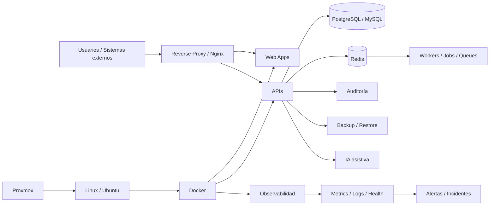

<div align="center">


### Sistemas reales. Infraestructura real. Automatización con criterio.


<br>

[**Perfil**](#perfil) · [**Portfolio**](#portfolio) · [**Capacidades**](#capacidades) · [**Arquitectura**](#arquitectura) · [**Stack**](#stack) · [**Método**](#metodo)

</div>

---

<h2 id="perfil">👨‍💻 Perfil</h2>

<table>
<tr>
<td width="61%" valign="top">

Soy **Licenciado en Sistemas** y **Jefe de IT**. Trabajo combinando desarrollo de software, infraestructura, automatización, operación y seguridad.

Mi especialidad es transformar procesos reales —planillas, aplicaciones heredadas, tareas manuales y herramientas aisladas— en **plataformas web integradas, seguras, auditables y operables**.

### Áreas donde más trabajo

- SaaS multiusuario y multi-tenant.
- CRM, ERP, backoffice y portales de servicios.
- APIs, integraciones, mensajería y procesamiento asíncrono.
- Linux, Docker, Nginx, Proxmox y bases de datos.
- Observabilidad, health checks, alertas, backups y recuperación.
- Seguridad por diseño: RBAC, MFA, auditoría, aislamiento y mínimo privilegio.
- IA asistiva para resumir, priorizar, detectar anomalías y apoyar operación.

</td>
<td width="39%" valign="top">

### 🎯 Enfoque

```yaml
perfil: Sistemas + Software + Infraestructura
rol: Jefe de IT
foco:
  - productos SaaS
  - sistemas empresariales
  - automatización
  - DevOps / SecOps
  - observabilidad
  - resiliencia
  - UX operativa
criterio:
  - preservar
  - revisar
  - validar
  - probar
  - documentar
```

</td>
</tr>
</table>

---

## ⚡ Qué construyo

<table>
<tr>
<td width="25%" align="center" valign="top">
<h3>🧩 Productos</h3>
SaaS, CRM, ERP, portales y soluciones verticales.
</td>
<td width="25%" align="center" valign="top">
<h3>🤖 Automatización</h3>
IA asistiva, workflows, integraciones y mensajería.
</td>
<td width="25%" align="center" valign="top">
<h3>🖥️ Plataforma</h3>
Linux, Docker, Proxmox, Nginx, datos y despliegues.
</td>
<td width="25%" align="center" valign="top">
<h3>🛡️ Resiliencia</h3>
Monitoreo, seguridad, auditoría, backups e incidentes.
</td>
</tr>
</table>

---

<h2 id="portfolio">🚀 Portfolio de sistemas</h2>

> 🔒 Gran parte del código y la lógica de negocio es privada. El perfil muestra únicamente alcance técnico y funcional, sin publicar IPs, credenciales, secretos, datos reales ni infraestructura sensible.

<table>
<tr>
<td width="50%" valign="top">

### 🛡️ Apollo WebGuard
**Observabilidad · Diagnóstico · SecOps**

Plataforma para centralizar monitoreo de servidores, servicios, Docker, disponibilidad, incidentes, evidencia, métricas, alertas, seguridad y recuperación operativa.

`Proxmox` `Docker` `Nginx` `Wazuh` `Grafana` `Prometheus` `Loki`


</td>
<td width="50%" valign="top">

### 🏥 Health Turnos SaaS
**SaaS multi-tenant para salud**

Turnos, pacientes, profesionales, sedes, coberturas, pagos, laboratorio, radiología, HCE, booking público, lista de espera, mensajería, facturación y administración SaaS.

Incluye MFA, auditoría, restore drills, presencia colaborativa, optimistic locking, timeline unificado y controles de privacidad.

`PostgreSQL` `Prisma` `Redis` `Docker` `RBAC` `MFA`


</td>
</tr>
<tr>
<td width="50%" valign="top">

### 💬 WA CRM Sender
**CRM · Mensajería · Integration Hub**

Plataforma multiempresa con campañas, contactos, conversaciones, API externa, webhooks firmados, workflows, Team Inbox, omnicanalidad, IA asistiva y centro de operaciones.

Arquitectura con PostgreSQL RLS, Redis/BullMQ, workers, reintentos, DLQ, preflight, Health Score, circuit breaker, backups y rollback de despliegues.

`PostgreSQL` `RLS` `Redis` `BullMQ` `Workers` `Docker`


</td>
<td width="50%" valign="top">

### 🛒 Exabyte ERP Store
**ERP + Ecommerce integrado**

Clientes, proveedores, productos, depósitos, stock, lector de código de barras, facturación interna, cuentas corrientes, presupuestos, tienda web, carrito, pagos, Mercado Libre, logística, conciliación y servicio técnico.

Incluye 2FA para roles sensibles, backend endurecido, validación de comprobantes y protección de secretos.

`Node.js` `MySQL` `Docker` `Nginx` `Ecommerce`


</td>
</tr>
<tr>
<td width="50%" valign="top">

### 🧾 BrokerFlow / OLBROKER
**InsurTech · Gestión para brokers**

Clientes, vehículos, pólizas, producción, siniestros, agenda, tareas, chat con presencia, reportes PDF, roles, auditoría, revocación de sesiones y copiloto IA opcional.

Las importaciones XLSX/CSV son transaccionales, con validación previa y rollback completo ante errores bloqueantes.

`Node.js` `MySQL` `Docker` `Nginx` `RBAC`


</td>
<td width="50%" valign="top">

### 🤝 CRM empresarial
**Vista 360 · Colaboración · IA asistiva**

Leads, contactos, agenda, WhatsApp, emails, presupuestos, planes, vehículos, operaciones, seguimiento, Timeline 360, presencia colaborativa, control de sobrescrituras y próxima acción sugerida.

`CRM` `Timeline 360` `Collaboration` `Automation` `AI`


</td>
</tr>
<tr>
<td width="50%" valign="top">

### 🌾 Silos Web
**Modernización de software agropecuario**

Evolución de una solución histórica hacia una plataforma web multiusuario con cálculos, dashboards, roles, validaciones, importación/exportación, reportes PDF, auditoría y backups.

`Spring Boot` `React` `MySQL` `Docker` `PDF` `Excel`


</td>
<td width="50%" valign="top">

### 💳 Financiera RM
**Workflow financiero para sucursales**

Solicitud, evaluación, aprobación y seguimiento de préstamos, operación de caja y cobranza de cupones con perfiles diferenciados para operador y supervisor.

`Workflow` `RBAC` `Auditoría` `Migración de legado`


</td>
</tr>
<tr>
<td width="50%" valign="top">

### 🏢 Portal STM
**Portal de afiliados + administración**

Padrón, afiliaciones, documentación, validaciones, beneficios, vouchers, portal del afiliado, portal administrativo, usuarios, roles, auditoría e integraciones de comunicación.

`Portal` `RBAC` `Auditoría` `Integraciones` `Responsive UX`


</td>
<td width="50%" valign="top">

### 🛍️ App Comprar Precios
**Comparador inteligente para compras**

Comparación por precio final, unidad, litro, peso o cantidad, listas de compra, análisis de ofertas y soporte a la decisión de compra.

`Web App` `Data` `Comparación` `Automatización`


</td>
</tr>
</table>

---

<h2 id="capacidades">🧠 Capacidades comprobadas en los proyectos</h2>

<table>
<tr>
<td width="33%" valign="top">

### 🔐 Seguridad

- RBAC y mínimo privilegio.
- MFA / TOTP.
- RLS multi-tenant.
- Auditoría y trazabilidad.
- Cifrado de datos sensibles.
- Sesiones revocables.
- Rate limiting y hardening.

</td>
<td width="33%" valign="top">

### ⚙️ Confiabilidad

- Health checks y readiness.
- Preflight antes de operaciones críticas.
- Reintentos y DLQ.
- Idempotencia.
- Circuit breakers.
- Backup + restore drill.
- Rollback de despliegues/importaciones.

</td>
<td width="33%" valign="top">

### 📊 Operación

- Dashboards operativos.
- Timeline / Vista 360.
- Centros de operaciones.
- Alertas e incidentes.
- Métricas y health scores.
- Colaboración/presencia.
- IA como copiloto.

</td>
</tr>
</table>

---

<h2 id="arquitectura">🏗️ Arquitectura de referencia</h2>



<div align="center">

**Negocio → UX → API → Datos → Automatización → Observabilidad → Seguridad → Recuperación**

</div>

---

<h2 id="stack">🛠️ Stack tecnológico</h2>

<div align="center">

### Desarrollo


### Datos · DevOps · Plataforma


<br><br>


</div>

---

<h2 id="metodo">🧭 Método de trabajo</h2>

<div align="center">

### PRESERVAR → REVISAR → CAMBIO MÍNIMO → VALIDAR → PROBAR → DOCUMENTAR

</div>

| Principio | Aplicación |
|---|---|
| **Preservar** | No romper módulos, datos o flujos ya estables. |
| **Revisar** | Auditar estado real antes de cambiar código. |
| **Cambio mínimo** | Resolver el problema sin reescrituras innecesarias. |
| **Validar** | Backend y reglas de negocio como autoridad. |
| **Probar** | Build, tests, smoke, health y pruebas funcionales. |
| **Documentar** | Versiones, cambios, decisiones, backups y procedimientos. |

### Principios transversales

- **No duplicar funciones** que ya existen y funcionan.
- **Seguridad por diseño**, no como agregado final.
- **Evidencia antes de declarar PASS**.
- **Backups que también se prueban restaurando**.
- **Automatización con control humano** cuando la decisión es sensible.
- **UX operativa simple**: menos clics, estados claros y acciones visibles.

---

<div align="center">

## 🤝 Perfil técnico

**Desarrollo · Infraestructura · Automatización · DevOps · SecOps · IA aplicada**

[](https://github.com/poto212)
[](https://github.com/poto212?tab=repositories)

<br><br>


</div>
