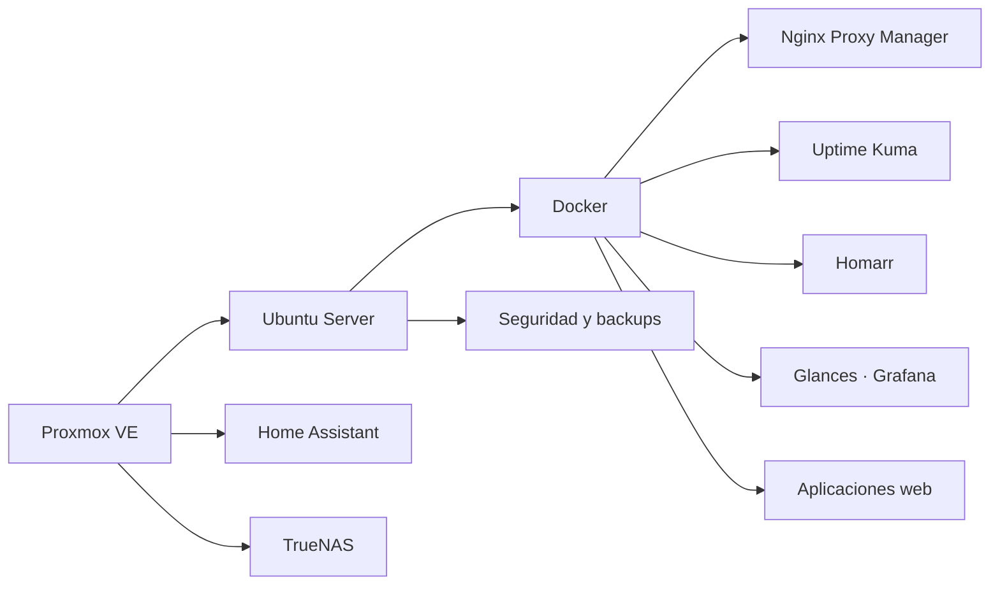

<div align="center">


<br>

[](https://github.com/poto212)


</div>

---

<table>
<tr>
<td width="58%" valign="top">

## 👨‍💻 Perfil profesional

Soy **Licenciado en Sistemas** y trabajo como **Jefe de IT**, combinando dirección tecnológica, infraestructura, soporte, automatización y desarrollo de software.

Mi enfoque es transformar procesos manuales o dispersos en soluciones digitales simples, seguras y escalables.

- Sistemas web multiusuario y productos SaaS.
- CRM, automatización comercial e integraciones.
- Linux, Docker, Nginx y despliegues.
- Virtualización y servicios sobre Proxmox.
- Monitoreo, observabilidad y seguridad.
- Inteligencia artificial aplicada a procesos reales.

</td>
<td width="42%" valign="top">

## 🎯 Enfoque actual

```yaml
rol: Jefe de IT
perfil: Desarrollo + Infraestructura
objetivo: Crear productos SaaS propios
prioridades:
  - Sistemas empresariales
  - Automatización con IA
  - DevOps y despliegues
  - Ciberseguridad
  - Monitoreo
ubicacion: Argentina
```

</td>
</tr>
</table>

---

<h2 id="proyectos-destacados">🚀 Proyectos destacados</h2>

<table>
<tr>
<td width="50%" valign="top">

### 📊 Sistema de gestión comercial

MVP web con dashboard, ingresos, egresos, clientes, proveedores, stock, facturación demo, informes, roles, MySQL y despliegue con Docker.


</td>
<td width="50%" valign="top">

### 💬 Plataforma WhatsApp + CRM

Campañas, múltiples sesiones, agenda, seguimiento comercial, métricas, automatización e integración con inteligencia artificial.


</td>
</tr>
<tr>
<td width="50%" valign="top">

### 🛒 Comparador de precios

Plataforma para comparar supermercados por unidad, litro, cantidad y lista de compra, mostrando ofertas y conveniencia total.


</td>
<td width="50%" valign="top">

### 🌾 Gestión de silos

Migración de una aplicación Java a una plataforma web multiusuario con roles, reportes, importación y copias de seguridad.


</td>
</tr>
</table>

> Los repositorios con lógica empresarial o información sensible se mantienen privados. En el perfil se presenta su arquitectura, alcance y estado real de avance.

---

## 🛠️ Tecnologías

<div align="center">

### Desarrollo


### Datos, infraestructura y operaciones


<br><br>


</div>

---

## 🏗️ Laboratorio e infraestructura



<div align="center">

`Proxmox` → `Ubuntu Server` → `Docker` → `Nginx` → `Aplicaciones` → `Monitoreo`

</div>

---

## 💼 Áreas en las que trabajo

<table>
<tr>
<td width="50%">🌐 Desarrollo de sistemas web</td>
<td width="50%">🐳 Docker y despliegues</td>
</tr>
<tr>
<td>⚙️ Automatización empresarial</td>
<td>🖥️ Linux, redes y Proxmox</td>
</tr>
<tr>
<td>🤖 Integración de inteligencia artificial</td>
<td>📊 Monitoreo y observabilidad</td>
</tr>
<tr>
<td>🧑‍💼 CRM y herramientas internas</td>
<td>🔐 Infraestructura y seguridad</td>
</tr>
</table>

---

## 🔄 Actividad y trabajo actual

<table>
<tr>
<td width="50%" valign="top">

### Desarrollo

- Evolución del sistema de gestión comercial.
- Diseño de soluciones CRM y SaaS.
- Automatización de procesos con IA.
- Migración de aplicaciones de escritorio a web.

</td>
<td width="50%" valign="top">

### Infraestructura

- Administración de Proxmox y Ubuntu Server.
- Despliegues con Docker y Nginx.
- Monitoreo con Uptime Kuma, Glances y Grafana.
- Seguridad, backups y documentación técnica.

</td>
</tr>
</table>

<div align="center">

[](https://github.com/poto212?tab=overview&from=2026-01-01&to=2026-12-31)
[](https://github.com/poto212?tab=repositories)

</div>

---

<div align="center">

## 🤝 Contacto y colaboración

Interesado en proyectos de desarrollo, infraestructura, automatización, inteligencia artificial y transformación digital.

[](https://github.com/poto212?tab=repositories)

<br><br>


</div>
