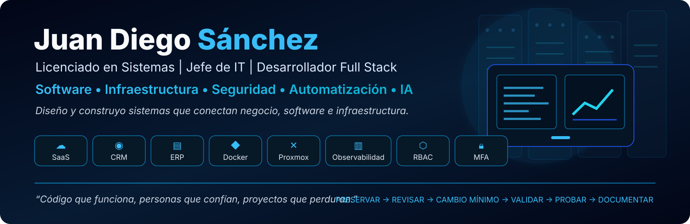
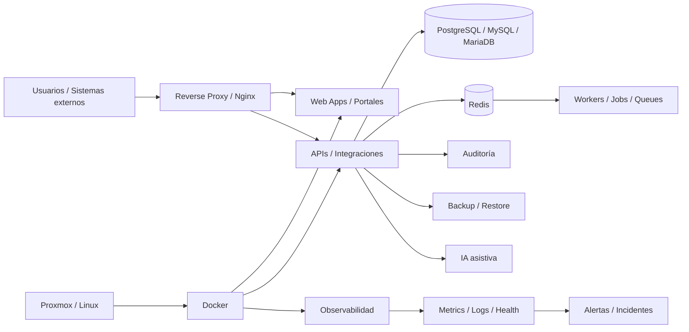

<div align="center">



### Sistemas reales. Infraestructura real. Automatización con criterio.


<br>

[**Perfil**](#perfil) · [**Qué resuelvo**](#que-resuelvo) · [**Destacados**](#destacados) · [**Portfolio**](#portfolio) · [**Arquitecturas**](#arquitecturas) · [**Stack**](#stack) · [**Método**](#metodo)

</div>

---

<h2 id="perfil">👨‍💻 Perfil</h2>

<table>
<tr>
<td width="62%" valign="top">

Soy **Licenciado en Sistemas** y **Jefe de IT**. Trabajo en el cruce entre desarrollo de software, infraestructura, automatización, operación y seguridad.

Mi foco es transformar procesos manuales, sistemas heredados y herramientas aisladas en **plataformas web integradas, seguras, observables y mantenibles**.

Trabajo especialmente con:

- SaaS multiusuario y multi-tenant.
- CRM, ERP, ITSM, backoffice y portales.
- APIs, integraciones, mensajería y workers.
- Linux, Docker, Nginx, Proxmox y bases de datos.
- Observabilidad, backups, recuperación e incidentes.
- RBAC, MFA, auditoría, RLS, BOLA/BFLA y hardening.
- IA asistiva con control humano.

</td>
<td width="38%" valign="top">

### 🎯 Enfoque

```yaml
perfil: Sistemas + Software + Infraestructura
rol: Jefe de IT
prioridades:
  - productos SaaS
  - sistemas empresariales
  - automatización
  - DevOps / SecOps
  - observabilidad
  - resiliencia
  - UX operativa
```

</td>
</tr>
</table>

---

<h2 id="que-resuelvo">🧭 Qué problemas resuelvo</h2>

<table>
<tr>
<td width="25%" align="center" valign="top">
<h3>🧩 Procesos</h3>
Planillas, tareas manuales y circuitos dispersos → sistemas integrados.
</td>
<td width="25%" align="center" valign="top">
<h3>🔄 Legacy</h3>
Aplicaciones históricas → plataformas web modernas y mantenibles.
</td>
<td width="25%" align="center" valign="top">
<h3>🖥️ Operación</h3>
Servicios aislados → observabilidad, alertas, backups y recuperación.
</td>
<td width="25%" align="center" valign="top">
<h3>🔐 Riesgo</h3>
Permisos débiles y poca trazabilidad → controles, auditoría y mínimo privilegio.
</td>
</tr>
</table>

---

<h2 id="destacados">⭐ Proyectos destacados</h2>

> Gran parte del código y de la lógica de negocio es privada. Acá muestro únicamente alcance técnico y funcional, sin publicar IPs, credenciales, secretos ni infraestructura sensible.

<table>
<tr>
<td width="50%" valign="top">

### 🛡️ Apollo WebGuard
**Observabilidad · Diagnóstico · SecOps**

Plataforma para centralizar monitoreo de servidores, servicios y contenedores, disponibilidad, incidentes, evidencia, métricas, alertas, backups y respuesta operativa asistida.

Integra conceptos y herramientas de **Proxmox, Docker, Nginx, Uptime Kuma, Glances, Wazuh, Grafana, Prometheus, Loki, Alertmanager y OpenTelemetry**.


</td>
<td width="50%" valign="top">

### 🏥 Health Turnos SaaS
**HealthTech · SaaS multi-tenant**

Agenda, pacientes, profesionales, sedes, coberturas, pagos, HCE, laboratorio, radiología, booking público, lista de espera, mensajería, facturación y administración SaaS.

Incluye **MFA, auditoría encadenada, restore drills, presencia colaborativa, optimistic locking, timeline unificado, privacidad por rol y resiliencia operativa**.

`PostgreSQL` `Prisma` `Redis` `Docker` `RBAC` `MFA`


</td>
</tr>
<tr>
<td width="50%" valign="top">

### 💬 WA CRM Sender
**CRM · Mensajería · Integration Hub**

Plataforma multiempresa con campañas, contactos, conversaciones, API externa, webhooks firmados, workflows, Team Inbox, omnicanalidad, IA asistiva y centro de operaciones.

Arquitectura con **PostgreSQL RLS, Redis/BullMQ, workers, reintentos, DLQ, preflight, Health Score, circuit breaker, backups y rollback de despliegues**.

`PostgreSQL` `RLS` `Redis` `BullMQ` `Workers` `Docker`


</td>
<td width="50%" valign="top">

### 🧾 BrokerFlow / OLBROKER
**InsurTech · Gestión para brokers**

Clientes, vehículos, pólizas, producción, siniestros, agenda, tareas, chat, reportes, roles, auditoría, MFA e IA opcional.

La base estable actual es **OLBROKER 6.6.7**, con estrategia **Blue/Green**, rollback preservado, datos compartidos protegidos y backups validados. Las importaciones XLSX/CSV son transaccionales y hacen rollback completo ante errores bloqueantes.

`Node.js` `MySQL / MariaDB` `Docker` `Nginx` `Blue/Green` `MFA`


</td>
</tr>
</table>

---

<h2 id="portfolio">🚀 Portfolio</h2>

| Proyecto | Problema / alcance | Tecnologías y prácticas |
|---|---|---|
| **🎫 Romera IT Desk** | ITSM, tickets, CMDB y soporte interno con web, email, API y Spark/Openfire | `Node.js` `MySQL` `Docker` `ITSM` `CMDB` |
| **🤝 CRM Romera** | Operación comercial con Timeline 360, colaboración, scoring y copiloto IA | `CRM` `RBAC` `Automation` `AI` |
| **🛒 Exabyte ERP Store** | ERP + ecommerce: stock, cuentas, presupuestos, pagos, logística y service | `Node.js` `MySQL` `Docker` `Nginx` |
| **🌾 Silos Web** | Modernización de software agropecuario legado | `Spring Boot` `React` `MySQL` `Docker` |
| **💳 Financiera RM** | Workflow financiero para sucursales, caja y cobranza | `Workflow` `RBAC` `Auditoría` |
| **🏢 Portal STM** | Afiliados, beneficios, vouchers, validaciones y administración | `RBAC` `BOLA/BFLA` `Rate Limit` `Responsive` |
| **🧮 EstudioRoza Contable** | Portal de clientes + backoffice contable | `Node.js` `PostgreSQL` `Docker` `MFA` |
| **🛍️ App Comprar Precios** | Comparación inteligente por precio, peso, volumen y unidad | `Web App` `Data` `Automation` |

---

## 🧠 Capacidades que reutilizo entre sistemas

<table>
<tr>
<td width="33%" valign="top">

### 🔐 Seguridad

- RBAC y mínimo privilegio.
- MFA / TOTP.
- RLS multi-tenant.
- BOLA / BFLA.
- Auditoría y trazabilidad.
- Sesiones revocables.
- Rate limiting y hardening.

</td>
<td width="33%" valign="top">

### ⚙️ Confiabilidad

- Health / readiness.
- Preflight.
- Idempotencia.
- Reintentos y DLQ.
- Circuit breakers.
- Backup + restore drill.
- Blue/Green y rollback.
- Imports transaccionales.

</td>
<td width="33%" valign="top">

### 📊 Operación

- Dashboards operativos.
- Timeline / Vista 360.
- Centros de operaciones.
- Alertas e incidentes.
- Health scores.
- Colaboración/presencia.
- ITSM / CMDB.
- IA como copiloto.

</td>
</tr>
</table>

---

<h2 id="arquitecturas">🏗️ Arquitecturas reales que implemento</h2>

<table>
<tr>
<td width="33%" valign="top">

### SaaS multi-tenant

```text
Web / Booking
      ↓
API + RBAC
      ↓
Tenant isolation
      ↓
PostgreSQL / Redis
      ↓
Workers + Audit
```

</td>
<td width="33%" valign="top">

### Sistemas empresariales

```text
Usuarios
   ↓
Nginx
   ↓
Frontend + API
   ↓
MySQL/PostgreSQL
   ↓
Integraciones
```

</td>
<td width="33%" valign="top">

### Observability / SecOps

```text
Hosts / Containers
        ↓
Metrics + Logs
        ↓
Correlation
        ↓
Alerts / Incidents
        ↓
Evidence / Runbooks
```

</td>
</tr>
</table>

### Arquitectura transversal



<div align="center">

**Negocio → UX → API → Datos → Automatización → Observabilidad → Seguridad → Recuperación**

</div>

---

<h2 id="stack">🛠️ Stack tecnológico</h2>

<div align="center">

### Desarrollo


### Datos · DevOps · Plataforma


<br><br>


</div>

---

<h2 id="metodo">🧭 Método de trabajo</h2>

<div align="center">

### PRESERVAR → REVISAR → CAMBIO MÍNIMO → VALIDAR → PROBAR → DOCUMENTAR

</div>

| Principio | Aplicación |
|---|---|
| **Preservar** | No romper módulos, datos o flujos estables. |
| **Revisar** | Auditar estado real antes de modificar. |
| **Cambio mínimo** | Resolver sin reescrituras innecesarias. |
| **Validar** | Backend y reglas de negocio como autoridad. |
| **Probar** | Build, tests, smoke, health y validación funcional. |
| **Documentar** | Versiones, cambios, backups y procedimientos. |

### Principios transversales

- **No duplicar** funciones que ya existen y funcionan.
- **Seguridad por diseño**, no como agregado final.
- **Evidencia antes de declarar PASS**.
- **Backups que también se prueban restaurando**.
- **Automatización con control humano** cuando la decisión es sensible.
- **UX operativa simple**: menos clics, estados claros y acciones visibles.

---

<div align="center">

## 🤝 Perfil técnico

**Desarrollo · Infraestructura · Automatización · DevOps · SecOps · IA aplicada**

[](https://github.com/poto212)
[](https://github.com/poto212?tab=repositories)

<br><br>


</div>
