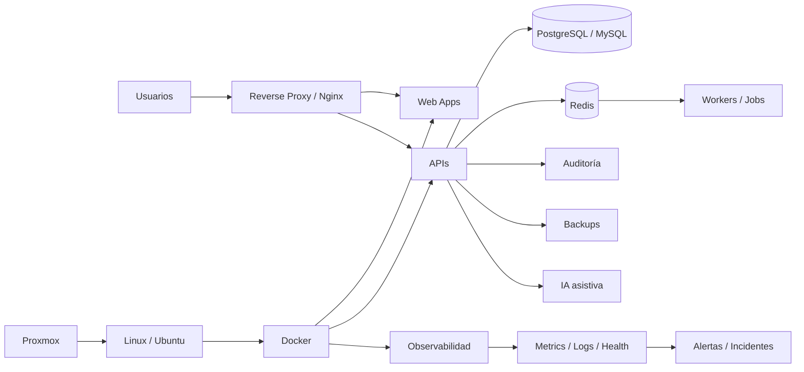

<div align="center">


### Diseño y construyo sistemas que conectan negocio, software e infraestructura


<br>

[**Perfil**](#perfil) · [**Portfolio**](#portfolio) · [**Arquitectura**](#arquitectura) · [**Stack**](#stack) · [**Principios**](#principios) · [**Contacto**](#contacto)

</div>

---

<h2 id="perfil">👨‍💻 Perfil</h2>

<table>
<tr>
<td width="62%" valign="top">

Soy **Licenciado en Sistemas** y trabajo en liderazgo de IT, desarrollo de software, infraestructura, automatización y seguridad.

Mi foco está en resolver problemas reales de operación: convertir procesos manuales, planillas, aplicaciones heredadas y herramientas aisladas en **plataformas web integradas, observables, auditables y seguras**.

Trabajo especialmente en:

- productos **SaaS multiusuario y multi-tenant**;
- CRM, ERP, backoffice y automatización empresarial;
- APIs, integraciones, mensajería y procesamiento asíncrono;
- Linux, Docker, Nginx, Proxmox y bases de datos;
- observabilidad, backups, recuperación e incidentes;
- seguridad por diseño, MFA, RBAC, auditoría y trazabilidad;
- inteligencia artificial aplicada como copiloto y apoyo operativo.

</td>
<td width="38%" valign="top">

### 🎯 Foco actual

```yaml
perfil: Systems + Software + Infrastructure
objetivo: productos propios y soluciones empresariales
prioridades:
  - SaaS y plataformas web
  - automatización con IA
  - DevOps / SecOps
  - observabilidad
  - resiliencia
  - UX operativa
metodo:
  - auditar
  - implementar
  - validar
  - medir
  - documentar
```

</td>
</tr>
</table>

---

## ⚡ Lo que estoy construyendo

<table>
<tr>
<td width="25%" align="center" valign="top"><h3>🧩 Productos</h3>SaaS, CRM, ERP, portales y herramientas verticales.</td>
<td width="25%" align="center" valign="top"><h3>🤖 Automatización</h3>IA asistiva, workflows, integraciones y mensajería.</td>
<td width="25%" align="center" valign="top"><h3>🖥️ Plataforma</h3>Linux, Docker, Proxmox, Nginx, datos y despliegues.</td>
<td width="25%" align="center" valign="top"><h3>🛡️ Resiliencia</h3>Monitoreo, auditoría, seguridad, backups e incidentes.</td>
</tr>
</table>

---

<h2 id="portfolio">🚀 Portfolio de sistemas</h2>

> Gran parte del código y de la lógica de negocio es privada. Acá muestro únicamente el alcance técnico y funcional, sin publicar infraestructura, credenciales ni información sensible.

<table>
<tr>
<td width="50%" valign="top">

### 🛡️ Apollo WebGuard
**Plataforma de observabilidad, diagnóstico y SecOps.**

Centraliza monitoreo multiservidor, servicios, Docker, disponibilidad, incidentes, evidencia, métricas, alertas, backups y acciones operativas asistidas.

`Proxmox` `Docker` `Nginx` `Wazuh` `Grafana` `Prometheus` `Loki` `SSH`


</td>
<td width="50%" valign="top">

### 🏥 Health Turnos SaaS
**Plataforma multi-tenant para salud.**

Turnos, pacientes, profesionales, sedes, coberturas, pagos, laboratorio, radiología, resultados, booking público, lista de espera, facturación, mensajería, auditoría y administración SaaS.

`PostgreSQL` `Prisma` `Redis` `Docker` `RBAC` `MFA` `Multi-tenant`


</td>
</tr>
<tr>
<td width="50%" valign="top">

### 💬 WA CRM Sender
**Mensajería empresarial + CRM + centro de operaciones.**

Campañas, contactos, conversaciones, agenda, colas, workers, scheduler, reintentos, DLQ, métricas reconciliadas, health score, preflight, automatizaciones e IA operativa.

`PostgreSQL` `RLS` `Redis` `BullMQ` `Workers` `Docker` `Nginx`


</td>
<td width="50%" valign="top">

### 🛒 Exabyte ERP Store
**ERP + ecommerce integrado.**

Productos, depósitos, stock, presupuestos, ventas, cobranzas, reportes, catálogo, carrito, checkout, reservas, pagos, marketplace, logística, servicio técnico y administración.

`Node.js` `MySQL` `Docker` `Nginx` `Ecommerce` `API`


</td>
</tr>
<tr>
<td width="50%" valign="top">

### 🧾 BrokerFlow / OLBROKER
**Gestión integral para productores y brokers de seguros.**

Clientes, pólizas, producción, agenda, tareas, reportes, importaciones con rollback, auditoría, chat, indicadores, MFA y analítica operativa/gerencial.

`Node.js` `MySQL` `Docker` `Analytics` `RBAC` `MFA`


</td>
<td width="50%" valign="top">

### 🤝 CRM empresarial
**Vista 360 para operación comercial.**

Leads, contactos, oportunidades, agenda, WhatsApp, emails, presupuestos, vehículos, operaciones, seguimiento, presencia colaborativa, actividad, próximas acciones y copiloto IA asistivo.

`CRM` `Timeline 360` `Collaboration` `Automation` `AI`


</td>
</tr>
<tr>
<td width="50%" valign="top">

### 🌾 Silos Web
**Modernización de software agropecuario legado.**

Migración de una solución histórica hacia una plataforma web multiusuario con cálculos, dashboards, roles, validaciones, importación/exportación, reportes PDF, auditoría y backups.

`Spring Boot` `React` `MySQL` `Docker` `PDF` `Excel`


</td>
<td width="50%" valign="top">

### 💳 Financiera RM
**Workflow financiero para sucursales.**

Solicitud, evaluación, aprobación y seguimiento de préstamos, operación de caja y cobranza de cupones, con perfiles diferenciados para operador y supervisor.

`Workflow` `RBAC` `Auditoría` `Migración de legado`


</td>
</tr>
<tr>
<td width="50%" valign="top">

### 🏢 Portal STM
**Portal de afiliados + administración.**

Padrón, afiliaciones, documentación, validaciones, beneficios, vouchers, portal del afiliado, administración, auditoría e integraciones de comunicación.

`Portal` `RBAC` `Auditoría` `Integraciones` `Responsive UX`


</td>
<td width="50%" valign="top">

### 🛍️ App Comprar Precios
**Comparador inteligente para compras.**

Comparación por precio final, unidad, litro, peso o cantidad, listas de compra, detección de ofertas y análisis para decidir dónde conviene comprar.

`Web App` `Data` `Comparación` `Automatización`


</td>
</tr>
</table>

---

## 🧠 Patrones que reutilizo entre proyectos

| Patrón | Aplicación |
|---|---|
| **Timeline / Vista 360** | contexto completo de clientes, pacientes, operaciones o incidentes |
| **RBAC + MFA + auditoría** | control de acceso, acciones sensibles y trazabilidad |
| **Health Score + preflight** | detectar problemas antes de ejecutar operaciones críticas |
| **Import con validación + rollback** | migraciones e importaciones seguras |
| **Centro de Operaciones** | reducir dependencia de consola y acelerar diagnóstico |
| **Workers + reintentos + DLQ** | procesos asíncronos resilientes |
| **Dashboards operativos y gerenciales** | métricas claras según el tipo de usuario |
| **IA asistiva** | sugerir, resumir y priorizar sin quitar control humano |
| **Backups + restore drills** | verificar que recuperar sea tan real como respaldar |
| **Responsive UX** | reducir clics y mantener claridad en desktop y móvil |

---

<h2 id="arquitectura">🏗️ Arquitectura que uso como referencia</h2>



<div align="center">

**Negocio → UX → API → Datos → Automatización → Observabilidad → Seguridad → Recuperación**

</div>

---

<h2 id="stack">🛠️ Stack</h2>

<div align="center">

### Desarrollo


### Datos · DevOps · Plataforma


<br><br>


</div>

---

<h2 id="principios">🧭 Principios de ingeniería</h2>

```text
PRESERVAR → REVISAR → CAMBIO MÍNIMO → VALIDAR → PROBAR → DOCUMENTAR
```

- **No duplicar:** primero entender lo que ya existe.
- **Backend como autoridad:** permisos, precios, estados y reglas críticas se validan en servidor.
- **Seguridad por diseño:** MFA, RBAC, validación, auditoría, secretos fuera del código y mínimo privilegio.
- **Operabilidad:** health checks, logs, métricas, alertas, backups y procedimientos de recuperación.
- **Evidencia antes de PASS:** build, tests, smoke, health y validación funcional.
- **IA con control humano:** asistencia y automatización donde aporta valor, sin delegar decisiones sensibles sin validación.
- **UX enfocada en operación:** menos clics, estados claros, responsive, accesibilidad y acciones visibles.

---

## 📈 Áreas en las que más trabajo

<div align="center">


</div>

---

<div id="contacto" align="center">

## 🤝 Contacto y colaboración

Me interesan proyectos donde se crucen **software, infraestructura, automatización, IA, seguridad y transformación digital**.

[](https://github.com/poto212)
[](https://github.com/poto212?tab=repositories)
[](https://github.com/poto212?tab=overview)

<br><br>


</div>
